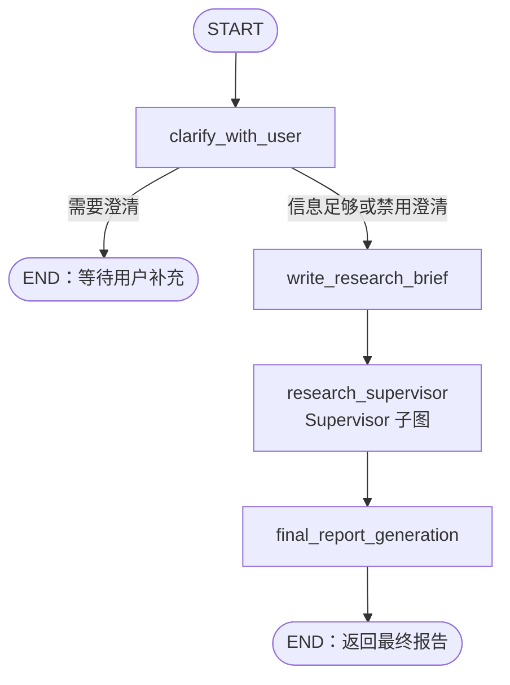
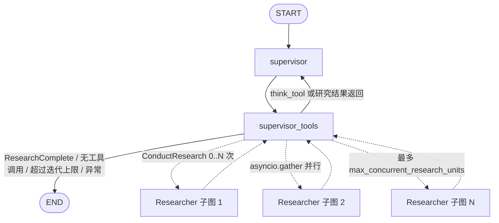
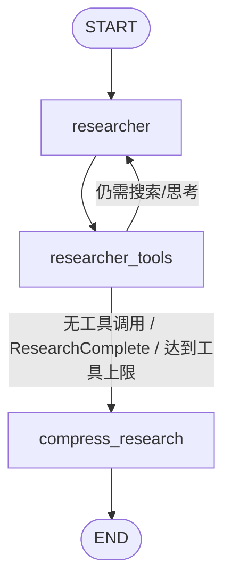

# Open Deep Research Baseline 架构说明

> Day 2 产出。分析基于固定上游 Commit
> `d337ae32ed4ff8f4c6fbe192ba3bf1b2d6610799`，并包含 ScholarMind Day 1
> 对本地 OpenAI 兼容 Base URL 的适配。

## 1. 阅读目标

这份文档解决四个问题：

1. 一个研究问题如何从用户输入变成最终报告；
2. Supervisor 为什么以及如何委派多个 Researcher；
3. 不同子图之间传递哪些状态，列表如何合并或覆盖；
4. 工具失败、迭代超限和 Token 超限时走哪条路径。

相关源码：

- `src/open_deep_research/deep_researcher.py`：三个状态图和所有节点；
- `src/open_deep_research/state.py`：结构化输出、State 与 Reducer；
- `src/open_deep_research/configuration.py`：运行配置；
- `src/open_deep_research/prompts.py`：各阶段 Prompt；
- `src/open_deep_research/utils.py`：搜索、MCP、Token 和模型辅助逻辑；
- `langgraph.json` / `langgraph.local.json`：图入口与运行方式。

## 2. 初学者词汇表

| 术语 | 在本项目中的含义 |
| --- | --- |
| State | 图运行期间共享的数据字典，例如消息、研究问题、研究笔记和最终报告 |
| Node | 接收 State、执行模型或工具、返回 State 更新的一段函数 |
| Edge | 从一个 Node 到另一个 Node 的固定连接 |
| Command | 节点同时返回 `goto` 和 `update`，动态决定下一步并更新 State |
| Subgraph | 嵌套在主图中的小状态图；本项目有 Supervisor 和 Researcher 子图 |
| Tool call | 模型不是直接回答，而是输出要调用的工具名称与参数 |
| Reducer | 多次更新同一个 State 字段时，决定“追加”还是“覆盖”的函数 |
| Structured output | 要求模型严格返回符合 Pydantic Schema 的字段 |
| Compression | 把 Researcher 的长工具历史清理成 Supervisor 可消费的研究结果 |

## 3. 三层图结构

Baseline 不是一个单循环，而是三层嵌套：

```text
Main Graph
└── Supervisor Subgraph
    └── 0..N 个并行 Researcher Subgraph
```

### 3.1 主图



主图只负责四件事：

1. 判断是否需要澄清；
2. 把对话改写成独立、详细的研究 Brief；
3. 让 Supervisor 子图完成研究；
4. 用研究结果生成最终报告。

### 3.2 Supervisor 子图



Supervisor 是研究经理，不直接搜索。它使用三类工具：

- `think_tool`：记录计划或反思；
- `ConductResearch`：把一个完整、独立的研究主题委派给 Researcher；
- `ResearchComplete`：表示资料已经足够。

### 3.3 Researcher 子图



Researcher 是具体执行者。它获得一个 `research_topic`，调用搜索、MCP、
`think_tool` 等工具，最后将长消息历史压缩成：

- `compressed_research`：给 Supervisor 阅读的清理后结果；
- `raw_notes`：保留工具和模型原始内容，便于后续追踪。

## 4. 完整执行时序

### 4.1 Clarify

节点：`clarify_with_user`

1. 从 `messages` 读取全部用户对话；
2. 如果 `allow_clarification=false`，不调用模型，直接进入 Brief；
3. 否则使用 `ClarifyWithUser` Schema 请求结构化输出；
4. `need_clarification=true` 时写入一个 AI 问题并结束本次图运行；
5. 信息足够时写入确认消息并继续。

结构化字段：

```text
need_clarification: bool
question: str
verification: str
```

### 4.2 Brief

节点：`write_research_brief`

1. 把全部 `messages` 转成字符串；
2. 使用 `ResearchQuestion` Schema 生成一条自包含的 `research_brief`；
3. 创建 Supervisor System Prompt；
4. 用 `override_reducer` 初始化 `supervisor_messages`；
5. 进入 Supervisor 子图。

Brief 的意义是让子研究任务不依赖原始对话中的隐含上下文。

### 4.3 Supervisor 规划

节点：`supervisor`

1. 读取 `supervisor_messages`；
2. 给模型绑定 `ConductResearch`、`ResearchComplete` 和 `think_tool`；
3. 模型返回一个或多个 Tool Call；
4. 将 AI 响应追加到 `supervisor_messages`；
5. `research_iterations += 1`；
6. 进入 `supervisor_tools`。

Supervisor 委派子任务的原因：

- 复杂问题可以拆成互不依赖的方向；
- 每个 Researcher 拥有独立上下文，减少单一上下文过长；
- 多个方向可以并行执行；
- Supervisor 可以根据第一轮结果继续补缺口，而不是一次生成最终答案。

### 4.4 Supervisor 执行工具

节点：`supervisor_tools`

首先检查三种结束条件：

```text
research_iterations > max_researcher_iterations
最近 AIMessage 没有 tool_calls
最近调用中包含 ResearchComplete
```

结束时：

- 从全部 Supervisor ToolMessage 提取 `notes`；
- 保留 `research_brief`；
- 结束 Supervisor 子图，回到主图 Writer。

未结束时：

1. 把 `think_tool` 反思包装成 ToolMessage；
2. 截取不超过 `max_concurrent_research_units` 个 `ConductResearch`；
3. 每个调用创建一个独立 Researcher 初始 State；
4. 使用 `asyncio.gather` 并行执行；
5. 将每个 `compressed_research` 按原调用顺序包装成 ToolMessage；
6. 将所有 Researcher 的 `raw_notes` 拼接后追加到主 State；
7. 回到 `supervisor` 继续判断。

超出并发数的 Research Call 不执行，而是返回一条错误 ToolMessage，让
Supervisor 下一轮重新规划。

### 4.5 Researcher 循环

节点：`researcher`

1. 通过 `get_all_tools` 装配工具；
2. 工具至少包括 `ResearchComplete` 和 `think_tool`；
3. 按配置加入 Tavily、OpenAI/Anthropic 原生搜索或 MCP；
4. 将工具绑定到 Research Model；
5. 追加 AI 响应；
6. `tool_call_iterations += 1`；
7. 进入 `researcher_tools`。

节点：`researcher_tools`

1. 如果模型没有普通 Tool Call，也没有原生搜索记录，进入压缩；
2. 否则把本轮所有 Tool Call 用 `asyncio.gather` 并行执行；
3. 单个工具异常由 `execute_tool_safely` 转成字符串，不直接抛出；
4. 将结果包装为 ToolMessage；
5. 达到 `max_react_tool_calls` 或调用 `ResearchComplete` 时进入压缩；
6. 否则回到 `researcher`。

### 4.6 Compression

节点：`compress_research`

压缩不是简单摘要。Prompt 要求：

- 删除明显重复和无关内容；
- 保留所有相关事实；
- 保留所有来源；
- 输出查询/工具列表、完整发现和 Sources。

为什么必须压缩：

1. 搜索页面和工具输出可能很长；
2. Supervisor 不需要重复看到 Researcher 的每一步思考；
3. 多个 Researcher 的全部原始历史直接合并会快速耗尽上下文；
4. `compressed_research` 是跨子图传输的稳定接口；
5. `raw_notes` 仍被保留，避免压缩后完全失去原始材料。

### 4.7 Writer

节点：`final_report_generation`

输入：

- `research_brief`
- 原始 `messages`
- Supervisor 退出时形成的 `notes`
- 当前日期

输出：

- `final_report`
- 一条写回 `messages` 的 AIMessage
- 使用 override 操作清空 `notes`

Writer Prompt 要求使用与用户相同的语言，组织 Markdown 标题，并生成来源列表。

## 5. State 与 Reducer

### 5.1 `override_reducer`

默认行为是列表追加：

```text
current_value + new_value
```

只有新值形如下面结构时才覆盖：

```json
{
  "type": "override",
  "value": []
}
```

使用位置：

- 初始化 `supervisor_messages`；
- 最终报告完成后清空 `notes`；
- 未来需要显式替换 `raw_notes` 或其他列表时。

### 5.2 状态字段流向表

| State | 字段 | Reducer/更新方式 | 主要写入者 | 主要读取者 | 作用 |
| --- | --- | --- | --- | --- | --- |
| AgentInputState | `messages` | `MessagesState` 消息合并 | 用户、Clarify、Writer | Clarify、Brief、Writer | 对话输入与最终回答 |
| AgentState | `supervisor_messages` | `override_reducer` | Brief、Supervisor、Supervisor Tools | Supervisor、Supervisor Tools | Supervisor 的独立消息历史 |
| AgentState | `research_brief` | 覆盖 | Brief、Supervisor 退出 | Supervisor、Writer | 自包含研究问题 |
| AgentState | `raw_notes` | `override_reducer`，通常追加 | Supervisor Tools | 当前主图未消费 | 原始研究材料，供追踪或未来持久化 |
| AgentState | `notes` | `override_reducer` | Supervisor 退出、Writer 清空 | Writer | 最终报告的直接研究输入 |
| AgentState | `final_report` | 覆盖 | Writer | API/Studio 用户 | 最终 Markdown 报告 |
| SupervisorState | `research_iterations` | 整数覆盖 | Supervisor | Supervisor Tools | 限制管理循环次数 |
| ResearcherState | `researcher_messages` | `operator.add` | Researcher、Researcher Tools | 两者、Compression | 单个 Researcher 的完整历史 |
| ResearcherState | `tool_call_iterations` | 整数覆盖 | Researcher | Researcher Tools | 限制 ReAct 工具循环 |
| ResearcherState | `research_topic` | 覆盖 | Supervisor Tools 初始化 | Researcher 上下文/追踪 | 单个子任务 |
| ResearcherState | `compressed_research` | 覆盖 | Compression | Supervisor Tools | 子图正式输出 |
| ResearcherState | `raw_notes` | `override_reducer` | Compression | Supervisor Tools | 子图原始材料 |

## 6. 并行与结果合并

### 6.1 并行发生在哪里

并行不是通过 LangGraph `Send` 实现，而是在两个工具节点中直接调用：

```python
await asyncio.gather(*tasks)
```

两层并行：

1. Supervisor 同一轮的多个 `ConductResearch` 并行；
2. 单个 Researcher 同一轮的多个搜索/MCP Tool Call 并行。

### 6.2 合并顺序

`asyncio.gather` 返回结果的顺序与输入任务顺序一致，因此：

- Researcher 结果按照 Supervisor Tool Call 顺序写回；
- 工具结果按照 Researcher Tool Call 顺序写回；
- Reducer 再把消息或笔记追加到已有列表。

### 6.3 当前失败隔离限制

Researcher 工具级别有隔离：单个工具失败会变成
`Error executing tool: ...`，其他工具仍可完成。

Supervisor 的 Researcher 级别没有真正隔离：

- `asyncio.gather` 默认遇到一个异常就整体抛出；
- `supervisor_tools` 捕获异常后直接结束研究阶段；
- 已成功的兄弟 Researcher 结果可能无法进入 State。

这正是 Day 5“隔离子研究任务失败”要解决的问题。

## 7. 结束与异常路径

| 位置 | 条件 | 当前行为 |
| --- | --- | --- |
| Clarify | 需要用户补充 | 写入澄清问题并结束，等待下一轮用户消息 |
| Structured Output | Schema 生成失败 | 按 `max_structured_output_retries` 重试 |
| Supervisor | 无 Tool Call | 结束研究，现有 ToolMessage 变成 `notes` |
| Supervisor | 调用 `ResearchComplete` | 结束研究 |
| Supervisor | `research_iterations > max_researcher_iterations` | 结束研究；由于使用 `>`，可能比直觉多一次循环 |
| Supervisor | ConductResearch 超过并发上限 | 超出部分不执行，返回错误 ToolMessage |
| Supervisor | 任一 Researcher 抛异常 | 当前代码直接结束研究 |
| Researcher | 无 Tool Call/原生搜索 | 进入 Compression |
| Researcher Tool | 单工具异常 | 返回错误字符串，其他并行工具继续 |
| Researcher | 达到 `max_react_tool_calls` | 执行完本轮工具后进入 Compression |
| Compression | Token 超限 | 最多 3 次尝试；删除截至最近一条 AIMessage 的尾部历史再试 |
| Compression | 其他异常 | 重试，但不改变输入；最终返回错误文本与 raw notes |
| Writer | Token 超限 | 查询模型上限、截断 findings，最多约 4 次生成尝试 |
| Writer | 非 Token 异常 | 立即返回错误报告，不再重试 |

## 8. 已确认的技术债

### 8.1 Supervisor 捕获了所有异常

源码条件：

```python
if is_token_limit_exceeded(e, configurable.research_model) or True:
```

`or True` 让条件永远成立，所以 Token 异常和普通异常没有区别，都会结束
Supervisor。这会隐藏真实故障，也会让部分成功结果丢失。计划在 Day 5 修复并
添加“部分成功、全部失败、单工具失败”测试。

### 8.2 本地 Qwen 不在 Token 上限表

`MODEL_TOKEN_LIMITS` 没有：

```text
openai:qwen3-14b-local
```

当前 vLLM 的 `max_model_len=16384`，但 Writer Token 超限时查不到这个值，
会返回“无法确定模型最大上下文”的错误报告。需要把模型上下文配置变成单一
可信来源，而不是只在静态表中维护。

### 8.3 `raw_notes` 在主图中未被消费

主图会保存 `raw_notes`，但 Writer 只读取 `notes`。这不是立即错误，但说明
Raw Notes 当前主要用于追踪，尚未进入持久化或证据模型。后续
Source—Evidence—Claim 设计应明确其去向，避免大对象长期留在图 State。

### 8.4 `SEARCH_API=none` 的语义

`get_all_tools` 始终返回：

- `ResearchComplete`
- `think_tool`

因此没有搜索 API 时 Researcher 仍然能运行和结束，但没有外部来源。模型可以
根据已有知识生成内容，不能把这种运行当成“检索成功”或引用可靠性证据。

## 9. Configuration 如何影响图

| 配置 | 影响节点 | 含义 |
| --- | --- | --- |
| `allow_clarification` | Clarify | 是否允许先向用户追问 |
| `max_structured_output_retries` | Clarify、Brief、Supervisor/Researcher 模型封装 | 结构化输出或模型调用重试 |
| `max_concurrent_research_units` | Supervisor Tools | 每轮最多并行 Researcher 数 |
| `search_api` | Researcher | Tavily、OpenAI、Anthropic 或 None |
| `max_researcher_iterations` | Supervisor | 管理循环预算 |
| `max_react_tool_calls` | Researcher Tools | 单个研究者工具循环预算 |
| `research_model` | Clarify、Brief、Supervisor、Researcher | 规划与研究模型 |
| `compression_model` | Compression | 清理研究结果 |
| `final_report_model` | Writer | 最终报告模型 |
| `openai_base_url` | 所有 `openai:` 模型角色 | 指向本地 vLLM 或其他兼容服务 |
| `mcp_config` / `mcp_prompt` | Researcher | 连接额外 MCP 工具 |

## 10. Prompt 与节点对应

| Prompt | 节点 | 主要约束 |
| --- | --- | --- |
| `clarify_with_user_instructions` | Clarify | 判断是否需要一次简洁追问 |
| `transform_messages_into_research_topic_prompt` | Brief | 具体、完整、第一人称、优先原始来源 |
| `lead_researcher_prompt` | Supervisor | 先思考、按主题委派、资料足够即停止 |
| `research_system_prompt` | Researcher | 宽搜→反思→窄搜，限制工具次数 |
| `compress_research_system_prompt` | Compression | 保留全部相关事实与来源，不做损失性摘要 |
| `final_report_generation_prompt` | Writer | 与用户同语言、Markdown 结构、完整 Sources |

## 11. 验收问题

### Supervisor 为什么委派子任务？

为了把复杂问题拆成可独立执行的研究方向，在受控并发下缩短等待时间，并让每个
Researcher 使用较小、聚焦的上下文。Supervisor 通过多轮反思决定是否补查，
最后用 `ResearchComplete` 结束。

### Researcher 为什么压缩结果？

工具输出和对话历史太长，直接返回会让 Supervisor 和 Writer 快速超出上下文。
Compression 保留事实与来源，同时形成稳定的 `compressed_research` 接口；
原始内容另存到 `raw_notes`。

### 异常和 Token 超限走什么路径？

- 工具异常：在 Researcher 内转成错误字符串；
- Researcher 子图异常：当前会触发 Supervisor 提前结束；
- Compression Token 超限：删除部分消息后重试；
- Writer Token 超限：按模型上下文上限逐步截断 findings；
- 本地 Qwen 上限尚未登记，因此 Writer 的自动恢复存在缺口。

## 12. Day 3 的直接输入

Day 3 的 Baseline Runner 应使用本文档中的阶段和状态定义记录：

- `case_id`
- 澄清次数
- Supervisor 循环次数
- Researcher 数和每个子任务
- 搜索/工具调用次数
- Compression 是否成功
- 最终状态与错误路径
- 总耗时与各阶段耗时
- 输入/输出 Token
- 来源数量和最终报告

这样 Day 4 的错误分析才能把质量问题定位到具体节点，而不是只评价最终文本。
